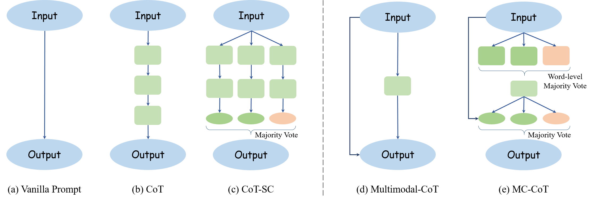

# Multimodal Consistent Chain-of-Thought (MC-CoT): Boosting the Power of Small Multimodal Reasoning Models to Match Larger Models with Self-Consistency Training

This repository contains the code for the paper "Boosting the Power of Small Multimodal Reasoning Models to Match Larger Models with Self-Consistency Training". Our work focuses on enhancing the capabilities of smaller multimodal reasoning models to achieve performance comparable to larger models.

[](https://paperswithcode.com/sota/science-question-answering-on-scienceqa?p=boosting-the-power-of-small-multimodal) <be>

[](https://paperswithcode.com/sota/visual-question-answering-on-a-okvqa?p=boosting-the-power-of-small-multimodal) <be>

## Abstract

Multimodal reasoning is a challenging task that requires models to reason across multiple modalities to answer questions. Existing approaches have made progress by incorporating language and visual modalities into a two-stage reasoning framework, separating rationale generation from answer inference. However, these approaches often fall short due to the inadequate quality of the generated rationales. In this work, we delve into the importance of rationales in model reasoning. We observe that when rationales are completely accurate, the model's accuracy significantly improves, highlighting the need for high-quality rationale generation. Motivated by this, we propose MC-CoT, a self-consistency training strategy that generates multiple rationales and answers, subsequently selecting the most accurate through a voting process. This approach not only enhances the quality of generated rationales but also leads to more accurate and robust answers. Through extensive experiments, we demonstrate that our approach significantly improves model performance across various benchmarks. Remarkably, we show that even smaller base models, when equipped with our proposed approach, can achieve results comparable to those of larger models, illustrating the potential of our approach in harnessing the power of rationales for improved multimodal reasoning.

A schematic comparison of different Chain-of-Thought (CoT) prompt-based reasoning methods including:
- Basic input-output prompt.
- Chain-of-Thought with intermediate chain-like reasoning.
- Chain-of-Thought Self-Consistency (CoT-SC), utilizing multiple independent thought chains.
- Multimodal-CoT, inferring rationale using text and image inputs.
- MC-CoT, which derives high-quality rationale through word-level voting.

  

## Datasets

The models are trained and evaluated on two open-source datasets:
- ScienceQA: Available at:
  - [Hugging Face Repository](https://huggingface.co/cooelf/vision_features/tree/main)
  - [Google Drive Link 1](https://drive.google.com/file/d/13B0hc_F_45-UlqPLKSgRz-ALtFQ8kIJr/view?pli=1)
  - [Google Drive Link 2](https://drive.google.com/drive/folders/1w8imCXWYn2LxajmGeGH_g5DaL2rabHev)
- A-OKVQA: Accessible at [AllenAI Project Page](https://allenai.org/project/a-okvqa/home).

The processed vision features for ScienceQA are available at [huggingfcae vision features](https://huggingface.co/cooelf/vision_features/tree/main). `all-MiniLM-L6-v2` and `unifiedqa-t5-base` can be downloaded at [huggingface sentence-transformers](https://huggingface.co/sentence-transformers/all-MiniLM-L6-v2) and [huggingface unifiedqa-t5-base](https://huggingface.co/allenai/unifiedqa-t5-base).

The pretrained base models on ScienceQA is available at [mc-cot/release/pretrained-base-model-on-scienceqa](https://github.com/chengtan9907/mc-cot/releases/download/scienceqa/results.zip).

The folder with all related files looks like:

```
mc-cot
├── assets
├── results
│   ├── base_pretrained_scienceqa
│   │   ├── answer
│   │   │   ├── ...
│   │   ├── rationale
│   │   │   ├── ...
├── models
│   ├── all-MiniLM-L6-v2
│   ├── unifiedqa-t5-base
├── data
│   ├── vision_features
│   ├── scienceqa
```

## Usage

To inference with our pretrained weights (`results/base_pretrained_scienceqa/`), run `run_eval_scienceqa.sh`.

To train the model by yourself, please run `run_train_scienceqa.sh`.

## Acknowledgements 

We highly thank "Multimodal Chain-of-Thought Reasoning in Language Models". [paper](https://arxiv.org/abs/2302.00923), [code](https://github.com/amazon-science/mm-cot)

## Reference
```
@article{tan2023boosting,
  title={Boosting the Power of Small Multimodal Reasoning Models to Match Larger Models with Self-Consistency Training},
  author={Tan, Cheng and Wei, Jingxuan and Gao, Zhangyang and Sun, Linzhuang and Li, Siyuan and Yang, Xihong and Li, Stan Z},
  journal={arXiv preprint arXiv:2311.14109},
  year={2023}
}
```
